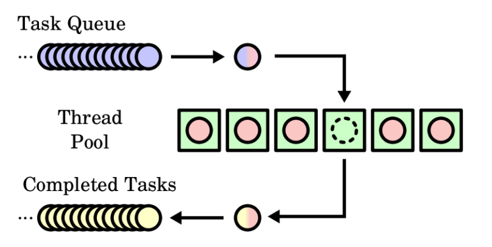

## 목표

자바의 멀티쓰레드 프로그래밍에 대해 학습하세요.

## 학습할 것 (필수)

- Thread 클래스와 Runnable 인터페이스
- 쓰레드의 상태
- 쓰레드의 우선순위
- Main 쓰레드
- 동기화
- 데드락

## Thread 란 ?

- 스레드란 참 어려운 내용이지만, 내가 여태껏 공부해온 정의는 하나의 프로세서에서의 특정한 흐름 중 하나이다.
  자바는 개인적으로 이 flow 중 하나가 method 하나라고 생각한다. 즉 method 안에 하나의 Thread 가 존재한다.
  개인적으로는 흐름으로 이해하는게 쉬우나, 메모리 공간을 가지고 움직이는 일꾼으로 이해하는게 맞는표현이 아닐까 싶다.

만약 멀티스레드라면, 이걸 두 스레드가 돌릴수도 있다는 뜻이다. 내가 이해한 Thread 는 그러하다.

## Thread 와 Runnable

(이 글은 백기선님 스터디에 누가 정리해준 글을 참고했다.)

- Thread 클래스가 다른 클래스가 확장할 필요가 있을때는 Runnable 을 구현해줘야 한다.

- Runnable 을 통한 람다로 동작도 가능하다.

## 스레드 우선 순위

- 스레드 우선순위는 특정 스레드가 점유율을 조금 더 가지게 하도록 한다고 생각하면 된다.

- 우선순위를 높게 가진 쓰레드는 작업큐에 더 많이 포함되며, 그니까 낮은 스레드와 높은 스레드가 있다면 상대적으로 높은 스레드가 먼져 작업을 점유하므로
  위와 같은 개념으로 생각하면 된다.

## Main Thread

- main thread 는 JVM 의 진입점으로 사용되는 스레드이다.

- main Thread 만 있는 프로그램은 SingleThread - application 이라고 할 수 있다. 우리가 다른 스레드를 파서 흐름을 분리해 낸다면 그때 부터 멀티 쓰레드 프로그래밍이라고 할 수 있다.

## 동기화

- 동기화는 하나의 작업이 끝날때 까지 기다리는 것을 의미하는데, 자바에서는 synchronized 를 이용하여 객체의 lock 을 걸어서 사용할 수 있다.
  다른 방법이 더 있는지는 모르겠지만, 일단 내가 아는 방식은 저 방식이다. 동기화는 객체의 lock 을 얻는 방식으로 이용하기에 무분별하게 남발한다면
  멀티 스레드 프로그래밍을 하는 이유가 없어질 수도 있게 된다. synchronized 를 써야 하는지, volatile 을 써야 하는지는 잘 판단해야 한다.

## Thread 의 상태

|          상태 |                                의미                                |
| ------------: | :----------------------------------------------------------------: |
|           NEW |         스레드 객체는 생성되었지만 아직 시작되지 않은 상태         |
|      RUNNABLE |                       쓰레드가 실행중인 상태                       |
|       BLOCKED | 스레드가 실행 중지 상태이며, 모니터 lock 이 풀리기를 기다리는 상태 |
|       WAITING |                      쓰레드가 대기 중인 상태                       |
| TIMED_WAITING |               특정 시간만큼 쓰레드가 대기 중인 상태                |
|    TERMINATED |                        쓰레드가 종료된 상태                        |

## DeadLock

- 데드락은 서로의 락을 얻으려 할때나, 예기치못한 오류로 Lock 해제가 되지 않았을때 발생합니다.
  만약 아래와 같은 코드를 살펴보자. 정상적인 자바코드가 아니고 이해를 시키기 위한 코드이므로 감안하고 보자!

```java
synchronized(lock1) {
  Thread1.watedLock(lock2);
}

synchronized(lock2) {
  Thread2.wantedLock(lock1)
}
```

- 위와 같이 Thread1 은 lock1 을 가지고 있지민, lock2 모니터 객체를 가지려고 하고있다. Thread2 도 lock2 를 가지고 있지만 lock1 의 모니터객체를 취득하려 하고있다.
  두 스레드가 서로가 끝나기를 계속해서 기다리므로 교착상태, 즉 데드락이 발생한다.

## 자바의 고유 Lock (instrinsic lock)

- 모든 객체는 고유하게 Lock 을 가지고 있다. 모니터 처럼 동작한다고 하여 Monitor 또는 Monitor Lock 이라고 한다.

- 그리고 자바의 고유 Lock 은 호출 단위가 아닌, 스레드 단위로 일어나는데 그러므로 이미 Lock 을 획득한 객체는 다시 획득하려고 노력하지 않아도 된다.
  즉 Reentrancy(재진입) 가 가능하다.

- 재진입은 이제 특정 스레드가 하나의 synchronized 안에서의 lock 을 획득하면, 그 정보와 method 정보를 caching 하여 해당 객체로 다시 접근할때는
  내부에서 캐싱된 정보를 사용해서 비직접적으로도 invoke 가 가능하거나, 혹은 직접 다시 접근해서 method 를 실행시키는 것이 가능하다는 뜻으로, 객체의 락을 획득하는
  오버헤드를 줄이는 방법으로 사용되는것 같습니다.

## 스레드 풀의 동작 방식

- 모든 ThreadPool 의 동작 방식은 기본적으로 동일하다. Task 를 받아들이는 큐가 있다. (자바에서는 Blocking Queue 를 이용하면 쉬울 것이다.)
  그 다음 몇개의 스레드는 큐에서 태스크를 받아서 실행시킨다. 태스크의 결과는 클라이언트로 되돌려주거나 데이터베이스나 다른 내부 데이터 구조에 저장할 수 있다.
  하지만 태스크를 끝낸 후 스레드는 실행할 다른 작업을 찾아오기 위해 태스크 큐로 되돌아간다.

  수행할 Task 가 없다면 Thread 는 대기 상태이다.

- 반대로 예를 들면, ThreadPool 에서 모든 Thread 가 active 중이라면, 작업은 작업가능한 Thread 가 있을때까지 대기하게 된다.

## 스레드를 Reuse 하는 이유?

- Thread 의 생성은 비용이 비싼 편이다.
  - 메모리 할당 및 Thread 간의 Context-Switching 도 고려해볼 비용이다.

## 사용 하는 이유

- ThreadPool 로 스레드를 관리하는 이유는 최적의 성능을 내는데 결정적인 풀의 크기 튜닝이다.
- 스레드 풀 성능은 스레드 풀 크기에 대한 기본 선택 사항에 따라 다양하며, 특정 환경에서 너무 큰 스레드 풀은 성능에 꽤 해로울 수 있다.
- 자동으로 Thread 의 Life Cycle 을 관리해준다.



## newFixedThreadPool

```java
public static ExecutorService newFixedThreadPool(int nThreads)
```

- 재사용이 가능한 unbounded queue 에서 operating 되는 고정된 스레드 개수의 풀을 생성합니다.
- n개의 Thread 들은 작업을 처리하는데 사용된다.
- 만약 모든 스레드가 작업중일때 작업을 추가한다면, 그 queue 는 스레드가 작업이 가능할때까지 기다립니다.
- 만약 작업중에 실패로 인해 스레드가 종료된다면, 후속 작업을 위해 새로운 스레드를 생성합니다.
- 만들어진 스레드 풀은 완전히 종료되기전까지 존재합니다.

```java
public static ExecutorService newFixedThreadPool(int nThreads,
                                 ThreadFactory threadFactory)
```

- 스레드를 생성할때 어떤 ThreadFactory 로 생성할지도 주입시켜 줄 수 있음.

## FiexdThreadPool 을 사용할때 적절한 Thread 의 개수 ?

- 최대 개수에 관한 간단한 답은 없다. 특히 최적의 스레드 개수는 각 개별 태스크가 얼마나 자주 대기 상태(Block) 되는 지에 따라 달려있다.
- GC 가 병렬 모드로 사용되는 경우 백그라운드 스레드는 힙을 처리하는데 뒤쳐지지 않도록 동작하기 위해 충분한 CPU 가 고려되야 하기에 이부분은 상당히 어렵다.. 책을 조금 더 많이 읽어봐야 할듯하다.

### Task 가 Compute-bound(연산 집중적) 인 경우

- 예를 들어 10000개의 주식 목 엔티티(Example Entity 이다 )의 이력을 계산할때 성능은, 한개 있을때는 255.6 초가 걸리지만 4개 있을때는 77초가 걸린다.
  그리고 4개 이상이 될때는 81.7 초로 오히려 더 시간이 증가한다. 스레드 생성 비용 및 컨텍스트 - 스위칭에 해당하는 비용으로 오히려 시간이 더 증가하였다.

- 스레드가 많아질 수록 CPU 점유 기준치 비율이 증가하는데, 64개일 경우 소요되는 시간은 60.44 초로 월등히 빠르나, 기준치 비율이 78%를 차지하게 되므로 위에서 설명했듯이
  GC 와 같은 백그라운드 스레드가 정상적으로 동작하기 힘들 수 있다.

- 우리의 자바 머신은 CPU 나 I/O 제약이 있는 머신이므로 이러한 원칙으로 증 / 감을 판단할 수 있다.
  - 단순히 스레드를 늘린다고 빨라지지 않는 다는 사실을 인지하자.

## newSingleThreadExecutor

- 위의 설명과 동일하게 unbounded queue 를 이용하며, single worker Thread 로 생성해준다.
- 주의 할점은 만약 스레드가 죽게되면, 새로운 스레드가 생성된다. 그니까 기존에 있던 싱글 스레드랑 같다고 생각하면 안된다. new 로 다시 만들어준다.

## newCachedThreadPool

```java
public static ExecutorService newCachedThreadPool()
```

- 스레드 풀을 필요한 만큼 만든다. 하지만 이전에 생성된 스레드들은 사용가능할때만 재사용이 가능하다.. 음 그니까 뭔가 트래픽이 낮은 어플리케이션을 사용한다면 CachedThreadPool 이 FixedThreadPool 보다 좋은 선택이 될 수 있다고 생각된다. 아마 TomCat 은 대규모 트래픽을 감당해야하지게 FixedThreadPool 로 서블릿이 생성되지 않을까 싶다. (어 근데.. 책을 읽다보니 CachedThreadPool 로 하는것 같다.)
- 이러한 스레드 풀은 전형적으로 short-lived 의 비동기 적인 작업을 많이 사용하는 프로그램에서 성능 향상을 가능하게 해준다.
- `excute` 함수를 call 할때 만약 재사용이 가능한 Thread 들이 있다면, 스레드를 재사용 한다.
- 내 생각인데, 트래픽이 일정하다면 재사용이 가능한 만큼의 스레드가 계속해서 생길것이므로 일정 크기의 스레드 풀이 평균적으로 Fixed 될거라고 생각한다. 그래서 트래픽이 많지 않고, 일정 하다면 CachedThreadPool 로 Thread 를 만들어도 된다고 생각한다.

```java
public static ExecutorService newCachedThreadPool(ThreadFactory threadFactory)
```

### 기타 Thread Pool 을 사용하는 방법

- 설명하기 귀찮아서 나머지는 궁금하면 직접 읽어보는걸로.

[Executors (Java Platform SE 7 )](<https://docs.oracle.com/javase/7/docs/api/java/util/concurrent/Executors.html#newFixedThreadPool(int)>)
